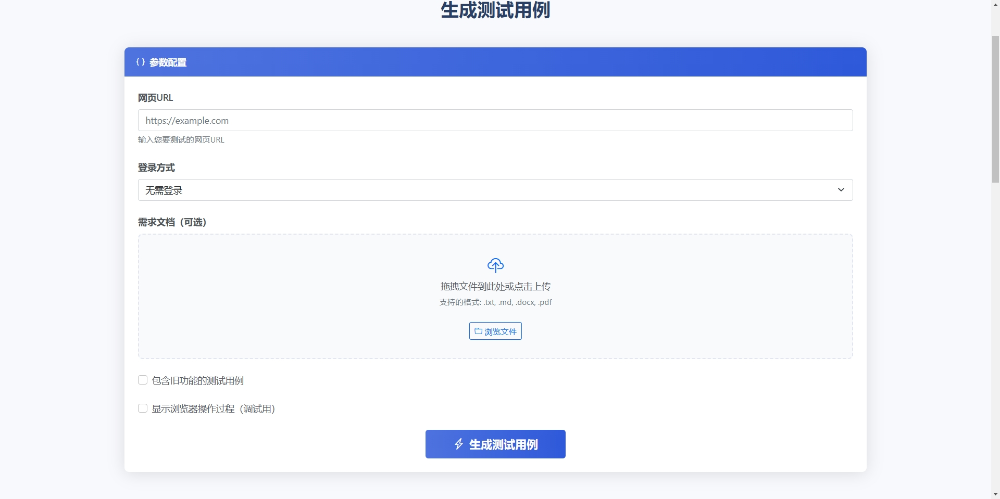
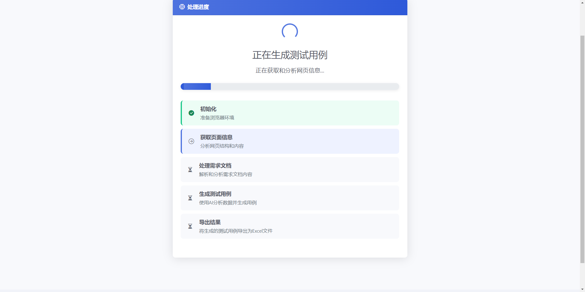

# AITestCase使用说明

## 1. 简介

AITestCase是一款基于OpenAI和Playwright的自动化测试工具，可以通过自动探索网页功能，结合需求文档，生成详细的测试用例。本工具支持多页面和多文档输入，能够智能识别页面的主内容区域，排除导航栏、侧边栏等页面框架元素。

## 2. 安装和配置

### 2.1 安装依赖

```bash
pip install -r requirements.txt
```

### 2.2 配置环境变量

复制`.env.example`为`.env`文件，并按照需要修改配置：

```bash
cp .env.example .env
```

主要配置项包括：

```
# OpenAI API配置
OPENAI_API_KEY=your_api_key_here  # OpenAI API密钥
OPENAI_BASE_URL=https://api.openai.com  # OpenAI API基础URL
OPENAI_MODEL=gpt-4  # 使用的模型
OPENAI_TEMPERATURE=0.7  # 温度参数

# Playwright配置
BROWSER_TYPE=chromium  # 浏览器类型：chromium/firefox/webkit
HEADLESS=true  # 是否以无头模式运行浏览器
SLOW_MO=0  # 浏览器操作的延迟毫秒数
TIMEOUT=30000  # 超时时间（毫秒）

# 输出配置
OUTPUT_DIR=output  # 测试用例输出目录
DEFAULT_EXCEL_FILENAME=test_cases.xlsx  # 默认Excel文件名

# 探索配置
MAX_DEPTH=2  # 最大探索深度
```

## 3. 使用方法

### 3.1 Web界面使用

AITestCase现提供了直观友好的Web界面，让您无需命令行操作即可使用所有功能。

#### 3.1.1 启动Web界面

```bash
python main.py --web
```

启动后，打开浏览器访问 `http://localhost:5000` 进入Web界面。

#### 3.1.2 Web界面功能

Web界面提供以下核心功能：

- **优雅的用户界面**：美观现代的设计，操作直观简便
- **表单填写**：通过表单填写所有测试参数，无需记忆命令行选项
- **文件上传**：支持拖放上传需求文档（支持.txt、.md、.docx格式）
- **多种登录方式**：支持用户名密码登录、Cookie登录或无需登录
- **实时进度反馈**：生成测试用例时提供直观的进度显示
- **结果下载**：生成完成后一键下载Excel测试用例文件

#### 3.1.3 使用步骤

1. **输入URL**：填写要测试的网页URL
2. **选择登录方式**：
   - 无需登录：直接探索公开页面
   - 用户名密码：输入账号和密码登录网站
   - Cookies登录：粘贴Cookie字符串进行登录
3. **上传需求文档**：可拖放上传一个或多个需求文档
4. **开始生成**：点击"生成测试用例"按钮开始处理
5. **查看进度**：观察处理进度和当前执行的阶段
6. **下载结果**：处理完成后下载Excel测试用例文件

#### 3.1.4 Web界面示例

下图展示了AITestCase的Web界面，您可以在此页面上配置所有测试参数：



上图为AITestCase的Web操作界面，您可以在此设置URL、登录方式、上传需求文档等参数，简单直观地生成测试用例。



上图展示了AITestCase生成测试用例后的结果页面，您可以在此查看测试结果并下载Excel文件。

### 3.2 启动工具（命令行）

```bash
python main.py
```

### 3.3 交互式使用

启动工具后，按照提示输入信息：

1. **输入要测试的页面URL**：可以输入多个URL，用逗号分隔
2. **选择登录方式**：
   - 无需登录：直接探索页面
   - 账号密码登录：提供用户名、密码和验证码（如果需要）
   - AI智能登录：使用AI技术自动识别各种登录页面元素
   - Cookies登录：提供包含认证信息的Cookies字符串
3. **输入需求文档**：可以输入多个需求文档的名称和路径
   - 支持的格式包括.txt（纯文本）、.md（Markdown）和.docx（Microsoft Word）
   - Word文档将自动转换为Markdown格式进行分析
4. **选择测试用例生成范围**：是否包含旧功能的测试用例

### 3.4 命令行参数

也可以通过命令行参数运行工具，支持批量处理和自动化集成：

```bash
python main.py --urls "https://example.com,https://example.com/page2" --requirements-files "需求1.docx,需求2.txt" --include-old
```

支持的命令行参数：

- `--urls`: 要测试的页面URL列表，用逗号分隔
- `--username`: 登录用户名
- `--password`: 登录密码
- `--captcha`: 验证码
- `--cookies`: Cookies字符串
- `--requirements-files`: 需求文档文件路径列表，用逗号分隔（支持.txt、.md、.docx格式）
- `--include-old`: 是否包含旧功能的测试用例（不需要值，仅标志）
- `--api-key`: OpenAI API密钥
- `--output`: 输出文件名
- `--output-dir`: 输出目录
- `--use-ai-login`: 是否使用AI智能识别登录元素（不需要值，仅标志）
- `--web`: 启动Web界面模式（不需要值，仅标志）

### 3.5 AI智能登录功能

工具支持使用AI技术智能识别各种登录页面元素，适用于复杂和非标准的登录页面。

#### 3.5.1 启用AI智能登录

交互式启动时，在登录方式选择中选择"使用AI智能登录"：
```
请选择登录方式 [无需登录/使用账号密码登录/使用AI智能登录/使用Cookies登录]: 使用AI智能登录
```

命令行方式启动时，使用 `--use-ai-login` 参数：
```bash
python main.py --urls "https://example.com" --username "your_username" --password "your_password" --use-ai-login
```

#### 3.5.2 AI智能登录工作原理

1. **多级识别策略**：首先使用基于规则的方法快速识别常见登录元素，然后使用AI技术进行优化和补充
2. **验证码智能处理**：能够识别验证码图片附近的输入框，准确填写验证码
3. **多种登录按钮支持**：支持各种UI框架的登录按钮，包括标准按钮、特殊类名按钮和自定义按钮
4. **自动回退机制**：当AI识别失败时，自动切换到传统登录方法，确保登录过程可靠

#### 3.5.3 适用场景

AI智能登录特别适用于以下场景：

- 非标准登录表单：没有使用标准HTML表单元素的登录页面
- 复杂UI框架：使用React、Vue等现代框架构建的复杂登录界面
- 特殊类名元素：使用动态生成或哈希后缀类名的元素
- 自定义登录组件：使用自定义UI组件或特殊布局的登录表单
- 多步骤登录：需要多步操作才能完成的登录流程

### 3.6 文档格式支持

本工具现在支持多种格式的需求文档：

#### 3.6.1 支持的格式
- **纯文本 (.txt)**：简单的文本需求文件
- **Markdown (.md)**：具有Markdown格式的结构化内容
- **Microsoft Word (.docx)**：Office文档格式

#### 3.6.2 文档转换
当您提供Word文档时，工具会自动：
1. 将DOCX文件转换为Markdown格式
2. 保留文档结构，包括标题、列表和表格
3. 使用转换后的内容生成测试用例

#### 3.6.3 不同文档格式的使用示例
```bash
# 使用Word文档
python main.py --url https://example.com --requirements-files "需求说明.docx"

# 同时使用多种文档格式
python main.py --url https://example.com --requirements-files "规格说明.docx,补充说明.txt,接口文档.md"
```

## 4. 输出结果

测试用例将导出为Excel文件，保存在`output`目录（除非指定了其他输出目录）。

Excel文件包含多个工作表：

1. **所有测试用例**：包含所有生成的测试用例
2. **主内容区域测试用例**：仅包含主内容区域的测试用例
3. **页面_xxx**：按页面来源分组的测试用例
4. **需求_xxx**：按需求文档分组的测试用例
5. **元数据**：包含测试用例生成的相关信息

测试用例采用颜色编码：
- 主内容区域测试用例：绿色背景
- 页面框架测试用例：橙色背景

## 5. 主内容区域识别规则

工具使用以下规则智能识别页面的主内容区域：

1. **选择器匹配**：优先查找常见的主内容区域选择器，如`main`、`#content`、`.main-content`等
2. **大小和位置**：分析元素的尺寸和位置，识别视口中占主要区域的元素
3. **排除元素**：自动排除导航栏、侧边栏、页脚等页面框架元素（通过`.env`文件中的`EXCLUDED_ELEMENTS`和内置规则）
4. **关键词过滤**：分析测试用例标题和步骤，排除包含导航、菜单、路由等关键词的测试用例

## 6. 多页面和多文档支持

### 6.1 多页面支持

工具可以同时探索多个页面，并综合分析生成测试用例：

1. **页面关联分析**：分析多个页面之间的关联，生成跨页面的测试用例
2. **页面分组**：在Excel输出中按页面来源分组显示测试用例
3. **来源标记**：每个测试用例会被标记来自哪个页面

### 6.2 多文档支持

工具可以分析多个需求文档，生成更全面的测试用例：

1. **需求整合**：将多个需求文档的内容整合分析
2. **需求分组**：在Excel输出中按需求文档分组显示测试用例
3. **来源标记**：每个测试用例会被标记来自哪个需求文档


## 7. 示例

### 7.1 单个页面，单个需求文档

```bash
python main.py --urls "https://example.com" --requirements-files "requirements.txt"
```

### 7.2 多个页面，多个需求文档

```bash
python main.py --urls "https://example.com/login,https://example.com/dashboard" --requirements-files "登录需求.docx,仪表盘需求.txt" --include-old
```

### 7.3 使用Cookies探索多个页面

```bash
python main.py --urls "https://example.com/profile,https://example.com/settings" --cookies "session=abc123; token=xyz789" --requirements-files "新功能.txt"
```

### 7.4 使用AI智能登录

```bash
python main.py --urls "https://example.com/login" --username "test_user" --password "test_password" --use-ai-login --requirements-files "登录需求.txt"
```

## 8. 常见问题与解决方案

### 8.1 工具无法登录网页

- 确保提供了正确的用户名和密码
- 如果网站有复杂的登录流程，可以尝试使用Cookies方式登录
- 检查您的网络连接和网站可访问性

### 8.2 无法生成测试用例

- 确保OpenAI API密钥配置正确
- 检查网络连接，确保可以访问OpenAI API
- 查看日志文件获取详细错误信息
- 可能需要调整模型参数或优化需求文档

### 8.3 生成的测试用例质量不高

- 尝试使用更高级的模型（如GPT-4）
- 提供更详细的需求文档
- 使用`--include-old`参数生成更全面的测试用例

### 8.4 工具无法识别或点击某些按钮怎么办？

最新版本已增强对特殊按钮的识别能力，特别是对于以下类型的按钮：

1. **特殊类名按钮**：对于使用哈希后缀类名的按钮（如`btnWrapper___dHE8V`），工具会尝试多种选择器方法识别这些元素
2. **Ant Design按钮**：增加了对Ant Design UI框架按钮的专门支持，包括`.ant-btn`、`.ant-btn-primary`等类型
3. **登录按钮**：针对登录功能进行了特别优化，增加了多种选择器和基于文本内容的识别方法

如果仍然遇到无法识别的按钮，可以尝试以下解决方法：

- 使用AI智能登录：对于复杂的登录页面，使用`--use-ai-login`参数启用AI智能识别登录元素
- 使用多个起始页面：通过`--urls`参数指定多个相关页面，让工具从不同入口点开始探索
- 使用自定义登录参数：如果是登录页面的按钮，可以使用`--username`和`--password`参数提供登录凭据

### 8.5 如何处理登录失败的情况？

如果登录过程失败，可以尝试以下几种方法：
1. 检查用户名和密码是否正确
2. 检查登录页面是否有验证码，如果有，请正确输入
3. 尝试使用Cookies登录方式
4. 检查网站是否有反爬虫机制，可能需要调整登录策略

### 8.6 如何获取并使用Cookies登录？

要获取和使用Cookies登录，请按照以下步骤操作：

1. 在浏览器中打开目标网站并手动登录
2. 打开浏览器开发者工具(F12)
3. 切换到"网络"或"Network"标签
4. 刷新页面，然后在请求列表中找到带有cookie的请求
5. 在请求头中找到"Cookie"字段，复制整个内容
6. 在工具中选择"使用Cookies登录"，并粘贴复制的内容

Cookies通常包含身份验证信息，使用它可以绕过复杂的登录过程。

# 使用指南

## 目录
1. [基本用法](#基本用法)
2. [登录功能](#登录功能)
   - [传统登录方式](#传统登录方式)
   - [AI辅助登录](#ai辅助登录)
   - [Cookie登录](#cookie登录)
3. [生成测试用例](#生成测试用例)
4. [常见问题](#常见问题)

## 基本用法

AItester提供了两种使用方式：交互式命令行和参数模式。

### 交互式命令行

最简单的使用方式是直接运行：

```bash
python main.py
```

系统会引导您输入所需的信息，包括URL、登录方式等。

### 参数模式

您也可以通过命令行参数直接指定：

```bash
python main.py --url https://example.com --depth 2 --output output/测试结果.xlsx
```

## 登录功能

AITestCase支持三种登录方式：

### 传统登录方式

通过预设选择器查找登录表单元素：

```bash
python main.py --url https://example.com --login-url https://example.com/login --username user123 --password pass123
```

如果需要填写验证码：

```bash
python main.py --url https://example.com --login-url https://example.com/login --username user123 --password pass123 --captcha 1234
```

### AI辅助登录

使用人工智能自动识别登录表单元素（v2.4.0新功能）：

```bash
python main.py --url https://example.com --login-url https://example.com/login --username user123 --password pass123 --use-ai-login
```

AI辅助登录功能会：

1. 分析页面HTML结构
2. 自动识别用户名、密码、验证码输入框和登录按钮
3. 生成精确的XPath选择器
4. 自动填写和提交表单

这个功能特别适合处理：
- 复杂的登录表单结构
- 使用特殊框架的网站
- 动态生成的表单元素
- 非标准命名的表单字段

如果AI识别失败，系统会自动回退到传统登录方式。

### Cookie登录

使用已有的Cookie进行登录：

```bash
python main.py --url https://example.com --login-url https://example.com --cookies "name1=value1; name2=value2"
```

## 生成测试用例

AItester会自动探索网页并生成测试用例，您可以控制探索深度：

```bash
python main.py --url https://example.com --depth 3
```

也可以通过关联需求文档生成测试用例：

```bash
python main.py --url https://example.com --requirements path/to/requirements.txt
```

## 常见问题

### 登录失败

如果登录失败，可以尝试：

1. 确认登录凭据是否正确
2. 使用AI辅助登录功能尝试更精准地定位登录元素
3. 检查网站是否需要验证码
4. 考虑使用Cookie登录方式绕过复杂的登录流程

### AI登录不成功

如果AI辅助登录功能不成功：

1. 确认您已正确配置OpenAI API密钥（在config/settings.py中）
2. 检查网站是否有反爬虫机制
3. 尝试提供更简化的登录页面URL
4. 系统会自动回退到传统登录方式

### 测试用例不足

如果生成的测试用例不够全面：

1. 增加探索深度（--depth参数）
2. 提供详细的需求文档关联测试生成
3. 考虑使用多个起点URL进行探索 