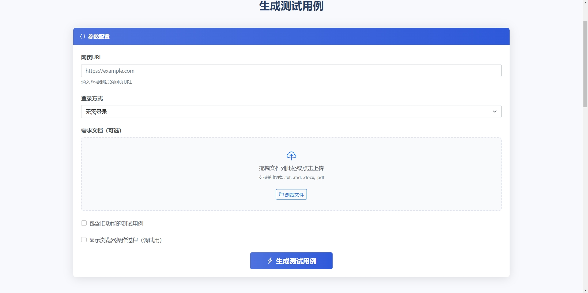

# AITestCase Usage Guide

## 1. Introduction

AITestCase is an automated testing tool based on OpenAI and Playwright, capable of generating detailed test cases by automatically exploring web page features and combining requirement documents. This tool supports multiple pages and document inputs, intelligently identifying the main content area of the page while excluding navigation bars, sidebars, and other page framework elements.

## 2. Installation and Configuration

### 2.1 Install Dependencies

```bash
pip install -r requirements.txt
```

### 2.2 Configure Environment Variables

Copy `.env.example` to `.env` and modify the configuration as needed:

```bash
cp .env.example .env
```

Main configuration items include:

```
# OpenAI API Configuration
OPENAI_API_KEY=your_api_key_here  # OpenAI API key
OPENAI_BASE_URL=https://api.openai.com  # OpenAI API base URL
OPENAI_MODEL=gpt-4  # Model used
OPENAI_TEMPERATURE=0.7  # Temperature parameter

# Playwright Configuration
BROWSER_TYPE=chromium  # Browser type: chromium/firefox/webkit
HEADLESS=true  # Whether to run the browser in headless mode
SLOW_MO=0  # Delay in milliseconds for browser operations
TIMEOUT=30000  # Timeout in milliseconds

# Output Configuration
OUTPUT_DIR=output  # Test case output directory
DEFAULT_EXCEL_FILENAME=test_cases.xlsx  # Default Excel filename

# Exploration Configuration
MAX_DEPTH=2  # Maximum exploration depth
```

## 3. Usage

### 3.1 Web Interface

AITestCase now provides an intuitive and user-friendly web interface that allows you to use all features without command line operations.

#### 3.1.1 Launch Web Interface

```bash
python main.py --web
```

After launching, open your browser and navigate to `http://localhost:5000` to access the web interface.

#### 3.1.2 Web Interface Features

The web interface offers the following core features:

- **Elegant User Interface**: Beautiful modern design with intuitive operation
- **Form Filling**: Fill in all test parameters via forms without having to remember command line options
- **File Upload**: Support for drag-and-drop upload of requirement documents (supports .txt, .md, .docx formats)
- **Multiple Login Methods**: Support for username/password login, cookie login, or no login
- **Real-time Progress Feedback**: Intuitive progress display when generating test cases
- **Result Download**: One-click download of the Excel test case file after generation is complete

#### 3.1.3 Usage Steps

1. **Enter URL**: Fill in the web page URL to be tested
2. **Select Login Method**:
   - No login required: Directly explore public pages
   - Username and password: Enter account and password to log in to the website
   - Cookies login: Paste cookie string for login
3. **Upload Requirement Documents**: Drag and drop to upload one or more requirement documents
4. **Start Generation**: Click the "Generate Test Cases" button to start processing
5. **View Progress**: Observe the processing progress and current execution stage
6. **Download Results**: Download the Excel test case file after processing is complete

#### 3.1.4 Web Interface Example

The image below shows the AITestCase web interface where you can configure all test parameters:



The image above shows the AITestCase web interface where you can configure test parameters such as URL, login method, and requirement documents in a simple and intuitive way.


The image above shows the result page after AITestCase generates test cases, where you can view test results and download the Excel file.

### 3.2 Start the Tool (Command Line)

```bash
python main.py
```

### 3.3 Interactive Use

After starting the tool, follow the prompts to enter information:

1. **Enter the URL to be tested**: Multiple URLs can be entered, separated by commas
2. **Select Login Method**:
   - No login required: Directly explore the page
   - Username and password login: Provide username, password, and captcha (if needed)
   - AI Smart Login: Automatically identify various login page elements using AI technology
   - Cookies Login: Provide a cookie string containing authentication information
3. **Enter Requirement Documents**: Multiple requirement document names and paths can be entered
   - Supported formats include .txt (plain text), .md (Markdown), and .docx (Microsoft Word)
   - Word documents will be automatically converted to Markdown format for analysis
4. **Select Test Case Generation Scope**: Whether to include test cases for old features

### 3.4 Command Line Parameters

The tool can also be run with command line parameters, supporting batch processing and automated integration:

```bash
python main.py --urls "https://example.com,https://example.com/page2" --requirements-files "requirement1.docx,requirement2.txt" --include-old
```

Supported command line parameters:

- `--urls`: List of page URLs to be tested, separated by commas
- `--username`: Login username
- `--password`: Login password
- `--captcha`: Captcha
- `--cookies`: Cookies string
- `--requirements-files`: List of new requirement document file paths, separated by commas (supports .txt, .md, .docx formats)
- `--include-old`: Whether to include test cases for old features (no value needed, just a flag)
- `--api-key`: OpenAI API key
- `--output`: Output filename
- `--output-dir`: Output directory
- `--use-ai-login`: Whether to use AI to intelligently identify login elements (no value needed, just a flag)
- `--web`: Launch web interface mode (no value needed, just a flag)

### 3.5 AI Smart Login Feature

The tool supports using AI technology to intelligently identify various login page elements, suitable for complex and non-standard login pages.

#### 3.5.1 Enable AI Smart Login

When starting interactively, choose "Use AI Smart Login" in the login method selection:
```
Please select login method [No login/Use username and password/Use AI Smart Login/Use Cookies Login]: Use AI Smart Login
```

When starting with command line, use the `--use-ai-login` parameter:
```bash
python main.py --urls "https://example.com" --username "your_username" --password "your_password" --use-ai-login
```

#### 3.5.2 AI Smart Login Working Principle

1. **Multi-level Recognition Strategy**: Quickly identify common login elements using rule-based methods, then optimize and supplement with AI technology
2. **Captcha Smart Handling**: Able to identify input boxes near captcha images and accurately fill in captchas
3. **Support for Various Login Buttons**: Supports login buttons from various UI frameworks, including standard buttons, special class name buttons, and custom buttons
4. **Automatic Fallback Mechanism**: When AI recognition fails, automatically switch to traditional login methods to ensure reliable login process

#### 3.5.3 Applicable Scenarios

AI Smart Login is particularly suitable for the following scenarios:

- Non-standard login forms: Login pages that do not use standard HTML form elements
- Complex UI frameworks: Complex login interfaces built with modern frameworks like React, Vue
- Special class name elements: Elements with dynamically generated or hashed suffix class names
- Custom login components: Login forms with custom UI components or special layouts
- Multi-step login: Login processes that require multiple steps to complete

### 3.6 Document Format Support

The tool now supports multiple document formats for requirement documents:

#### 3.6.1 Supported Formats
- **Plain Text (.txt)**: Simple text files with requirements
- **Markdown (.md)**: Structured content with Markdown formatting
- **Microsoft Word (.docx)**: Office document format

#### 3.6.2 Document Conversion
When you provide a Word document, the tool automatically:
1. Converts the DOCX file to Markdown format
2. Preserves the document structure including headings, lists, and tables
3. Uses the converted content for test case generation

#### 3.6.3 Usage Examples with Different Document Formats
```bash
# Using a Word document
python main.py --url https://example.com --requirements-files "requirements.docx"

# Using multiple document formats together
python main.py --url https://example.com --requirements-files "specs.docx,additional_notes.txt,api_documentation.md"
```

## 4. Output Results

Test cases will be exported as Excel files and saved in the `output` directory (unless another output directory is specified).

The Excel file contains multiple worksheets:

1. **All Test Cases**: Contains all generated test cases
2. **Main Content Area Test Cases**: Only includes test cases for the main content area
3. **Page_xxx**: Test cases grouped by page source
4. **Requirement_xxx**: Test cases grouped by requirement document
5. **Metadata**: Contains information related to test case generation

Test cases are color-coded:
- Main content area test cases: Green background
- Page framework test cases: Orange background

## 5. Main Content Area Identification Rules

The tool uses the following rules to intelligently identify the main content area of the page:

1. **Selector Matching**: Prioritize finding common main content area selectors, such as `main`, `#content`, `.main-content`, etc.
2. **Size and Position**: Analyze the size and position of elements to identify elements that occupy the main area of the viewport
3. **Exclude Elements**: Automatically exclude navigation bars, sidebars, footers, and other page framework elements (through `EXCLUDED_ELEMENTS` in the `.env` file and built-in rules)
4. **Keyword Filtering**: Analyze test case titles and steps to exclude test cases containing keywords like navigation, menu, routing, etc.

## 6. Multi-page and Multi-document Support

### 6.1 Multi-page Support

The tool can explore multiple pages simultaneously and generate test cases through comprehensive analysis:

1. **Page Association Analysis**: Analyze the association between multiple pages to generate cross-page test cases
2. **Page Grouping**: Display test cases grouped by page source in Excel output
3. **Source Marking**: Each test case will be marked with the page it came from

### 6.2 Multi-document Support

The tool can analyze multiple requirement documents to generate more comprehensive test cases:

1. **Requirement Integration**: Integrate and analyze the content of multiple requirement documents
2. **Requirement Grouping**: Display test cases grouped by requirement document in Excel output
3. **Source Marking**: Each test case will be marked with the requirement document it came from

## 7. Examples

### 7.1 Single Page, Single Requirement Document

```bash
python main.py --urls "https://example.com" --requirements-files "requirements.txt"
```

### 7.2 Multiple Pages, Multiple Requirement Documents

```bash
python main.py --urls "https://example.com/login,https://example.com/dashboard" --requirements-files "login_requirements.docx,dashboard_requirements.txt" --include-old
```

### 7.3 Explore Multiple Pages with Cookies

```bash
python main.py --urls "https://example.com/profile,https://example.com/settings" --cookies "session=abc123; token=xyz789" --requirements-files "new_features.txt"
```

### 7.4 Use AI Smart Login

```bash
python main.py --urls "https://example.com/login" --username "test_user" --password "test_password" --use-ai-login --requirements-files "login_requirements.txt"
```

## 8. Common Issues and Solutions

### 8.1 Tool Cannot Log in to Web Page

- Ensure the correct username and password are provided
- If the website has a complex login process, try using the Cookies login method
- Check your network connection and website accessibility

### 8.2 Cannot Generate Test Cases

- Ensure the OpenAI API key is configured correctly
- Check the network connection to ensure access to the OpenAI API
- View log files for detailed error information
- You may need to adjust model parameters or optimize requirement documents

### 8.3 Generated Test Cases Are of Low Quality

- Try using a more advanced model (such as GPT-4)
- Provide more detailed requirement documents
- Use the `--include-old` parameter to generate more comprehensive test cases

### 8.4 Tool Cannot Recognize or Click Certain Buttons

The latest version has enhanced recognition capabilities for special buttons, especially for the following types of buttons:

1. **Special Class Name Buttons**: For buttons with hashed suffix class names (e.g., `btnWrapper___dHE8V`), the tool will try multiple selector methods to identify these elements
2. **Ant Design Buttons**: Added special support for Ant Design UI framework buttons, including `.ant-btn`, `.ant-btn-primary`, etc.
3. **Login Buttons**: Special optimization for login functionality, adding multiple selectors and text-based recognition methods

If you still encounter unrecognized buttons, try the following solutions:

- Use AI Smart Login: For complex login pages, enable AI smart recognition of login elements with the `--use-ai-login` parameter
- Use multiple starting pages: Specify multiple related pages with the `--urls` parameter to let the tool start exploring from different entry points
- Use custom login parameters: If it's a login page button, provide login credentials with the `--username` and `--password` parameters

### 8.5 How to Handle Login Failures?

If the login process fails, try the following methods:
1. Check if the username and password are correct
2. Check if there is a captcha on the login page, and if so, enter it correctly
3. Try using the Cookies login method
4. Check if the website has anti-crawling mechanisms, you may need to adjust the login strategy

### 8.6 How to Obtain and Use Cookies for Login?

To obtain and use cookies for login, follow these steps:

1. Open the target website in a browser and log in manually
2. Open the browser developer tools (F12)
3. Switch to the "Network" tab
4. Refresh the page, then find the request with cookies in the request list
5. Find the "Cookie" field in the request header and copy the entire content
6. In the tool, choose "Use Cookies Login" and paste the copied content

Cookies usually contain authentication information, allowing you to bypass complex login processes.

## Advanced Features